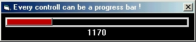



## Every vb controll is progress bar

### Description

Here is an easy way to bypass the simple and normal progress bar in vb any controll in vb can be a progress bar itself see the code its very easy this is for beginners as well as for some advanced users can be a nice simple example, i place an option controll you can place whatever you like as well ( label, button, shape, line, textbox, etc ) Thx enjoy :)
 
### More Info
 

             |
---                |---
**Submitted On**   |2003-03-11 02:16:12
**By**             |[kegham](https://github.com/Planet-Source-Code/PSCIndex/blob/master/ByAuthor/kegham.md)
**Level**          |Beginner
**User Rating**    |4.0 (16 globes from 4 users)
**Compatibility**  |VB 5\.0, VB 6\.0
**Category**       |[Files/ File Controls/ Input/ Output](https://github.com/Planet-Source-Code/PSCIndex/blob/master/ByCategory/files-file-controls-input-output__1-3.md)
**World**          |[Visual Basic](https://github.com/Planet-Source-Code/PSCIndex/blob/master/ByWorld/visual-basic.md)
**Archive File**   |[Every\_vb\_c1557963112003\.zip](https://github.com/Planet-Source-Code/kegham-every-vb-controll-is-progress-bar__1-43933/archive/master.zip)

